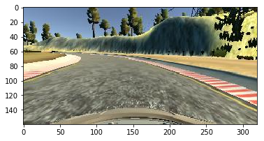
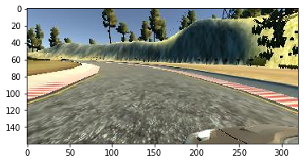
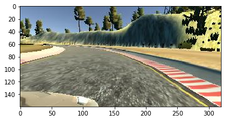
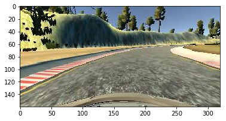

# **Behavioral Cloning** 


---
### Files Submitted & Code Quality
#### 1. Files Submitted
model.py - includes my network model in python
model.h5 - training results
writeup_report.md - report
drive.py - the same as given

supplementarie:
    model.ipynb - jupyter notebook, which I first used to build my network
    model.log   - training log

#### 2. Submission includes functional code
Using the Udacity provided simulator and my drive.py file, the car can be driven autonomously around the track by executing 
```sh
python drive.py model.h5
```


### Model Architecture and Training Strategy

#### 1. An appropriate model architecture has been employed

My model consists of a similar convolution neural network to an example of NVIDIA's network. 

The model starts from cropping input, 50 pixels from top, 20 pixels at the bottom. 

    model.add(Cropping2D(cropping=((50,20), (0,0)), input_shape=input_shape))

The lambda layer to normalize input is following.

    model.add(Lambda(lambda x: (x / 255.0) - 0.5))

First convolution layers have kernel size '5' and strides '2', so that the layers reduces spatial size of features without pooling. Each convolution includes RELU layers to introduce nonlinearity. 


    model.add(Convolution2D(base_depth           , 5, strides=(2,2))) 
    model.add(Activation('relu'))
    model.add(Convolution2D(base_depth+addition*1, 5, strides=(2,2))) 
    model.add(Activation('relu'))
    model.add(Convolution2D(base_depth+addition*2, 5, strides=(2,2)))
    model.add(Activation('relu'))

Second group of convolution layers have kernel size '2' and strides '1' by widening its depth as layers go deeper.

    model.add(Convolution2D(base_depth+addition*3, 3)) 
    model.add(Activation('relu'))
    model.add(Convolution2D(base_depth+addition*4, 3)) 
    model.add(Activation('relu'))
    model.add(Convolution2D(base_depth+addition*5, 3)) 
    model.add(Activation('relu'))

Finally, four fully connected layers are deployed to regress steering angle. 

    model.add(Flatten())
    model.add(Dense(128))
    model.add(Dense(50))
    model.add(Dense(10))
    model.add(Dense(1))


#### 2. Attempts to reduce overfitting in the model

I have all the center, left, right images as inputs, moreover, all the flipped images of them to generalize the network. After trying to train and validate several times, I could find that the network always settles in validation within 5 epochs. So, after that, I've reduced validation_split to '0.05'.

#### 3. Model parameter tuning

The model used an adam optimizer, so the learning rate was not tuned manually. The epoch value, 5, was found impirically while training and validating. 

    model.compile(loss='mse', optimizer='adam')
    model.fit(X_train, y_train, validation_split=0.05, shuffle=True, epochs=5)

#### 4. Appropriate training data

I've collected data about two and half laps of amount, so that, the data includes more right-turns , more turns with big angle. Then, I've used all the center, left, right images and their flipped images as input. For flipped images, I've compensated steer angle values with amount of '0.2'. With only one track data and without flipped data, I could barely succeed to turn at the first left-turn.


### Model Architecture and Training Strategy

#### 1. Solution Design Approach

The overall strategy for deriving a model architecture was to start from well-working, well-known network, which is NVIDIA's I took. It had shown great result from the start.
However, I've found that the input cropping is slightly different between mine and NVIDIA's in the lecture. Therefore, I've tuned the depth of last convolution layer, and the size of the first fully connected layer. Since my input was a bit bigger, I've given bigger value of depth, size of the layers. 

#### 2. Final Model Architecture

Here is a visualization of the architecture (from model.summay() of keras)

Layer (type)                 Output Shape              Param #
_________________________________________________________________
cropping2d_1 (Cropping2D)    (None, 90, 320, 3)        0
_________________________________________________________________
lambda_1 (Lambda)            (None, 90, 320, 3)        0
_________________________________________________________________
conv2d_1 (Conv2D)            (None, 43, 158, 24)       1824
_________________________________________________________________
activation_1 (Activation)    (None, 43, 158, 24)       0
_________________________________________________________________
conv2d_2 (Conv2D)            (None, 20, 77, 36)        21636
_________________________________________________________________
activation_2 (Activation)    (None, 20, 77, 36)        0
_________________________________________________________________
conv2d_3 (Conv2D)            (None, 8, 37, 48)         43248
_________________________________________________________________
activation_3 (Activation)    (None, 8, 37, 48)         0
_________________________________________________________________
conv2d_4 (Conv2D)            (None, 6, 35, 60)         25980
_________________________________________________________________
activation_4 (Activation)    (None, 6, 35, 60)         0
_________________________________________________________________
conv2d_5 (Conv2D)            (None, 4, 33, 72)         38952
_________________________________________________________________
activation_5 (Activation)    (None, 4, 33, 72)         0
_________________________________________________________________
conv2d_6 (Conv2D)            (None, 2, 31, 84)         54516
_________________________________________________________________
activation_6 (Activation)    (None, 2, 31, 84)         0
_________________________________________________________________
flatten_1 (Flatten)          (None, 5208)              0
_________________________________________________________________
dense_1 (Dense)              (None, 128)               666752
_________________________________________________________________
dense_2 (Dense)              (None, 50)                6450
_________________________________________________________________
dense_3 (Dense)              (None, 10)                510
_________________________________________________________________
dense_4 (Dense)              (None, 1)                 11
_________________________________________________________________
Total params: 859,879
Trainable params: 859,879
Non-trainable params: 0


#### 3. Creation of the Training Set & Training Process

To capture good driving behavior, I used mouse instead of keyboard to control the simaltor. With setting mouse sensitivity value to very low (in-sensitive), I could aquire more fine angle values. While collecting, I had just tried to maintain in center position. Further more, I recorded two and half laps of data, to generalize network more. 

Here is the image of center:



Then, I've used left and right image, too :

Left image:



Right image:




To augment the dataset, I also flipped images, this could balance the network to work well on both sides of angle.
Here is an image of flipped from the center:



When training, I gave the 'shuffle' parameter value to 'True' to randomly shuffle the dataset.

I used this training data for training the model. As I mentioned before, I've already found the validation results settles in 5 epochs, I set validation split a bit low, 0.05. The ideal number of epochs was 5 as impirically chosen by repeated training. I used an adam optimizer so that manually training the learning rate wasn't necessary.
